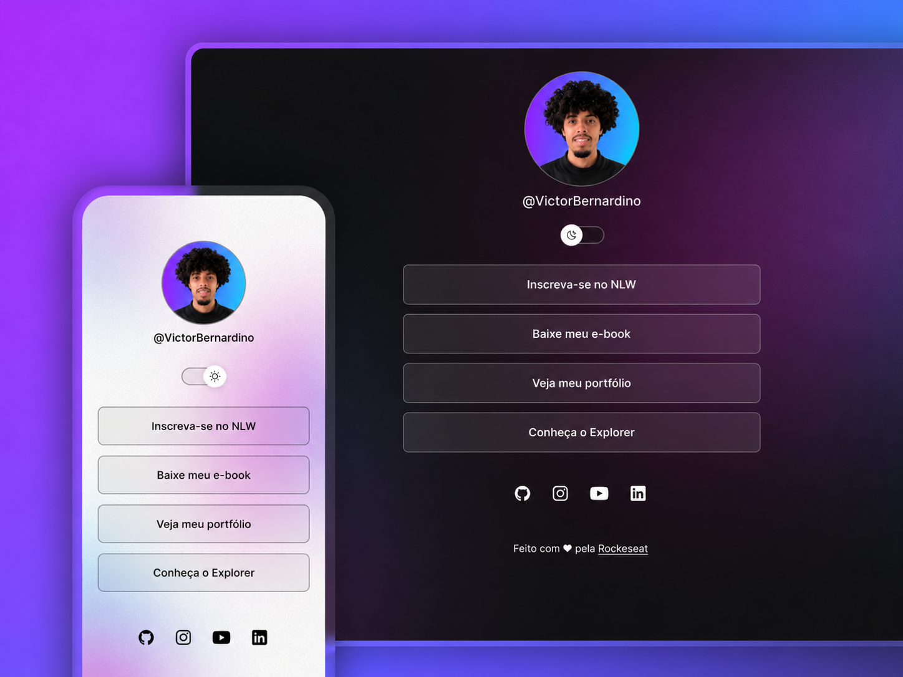

<h1 align="center">DevLinks</h1>

Projeto desenvolvido durante meus estudos de Análise e Desenvolvimento de Sistemas.

  <a href="#-objetivo">Objetivo</a>&nbsp;&nbsp;&nbsp;|&nbsp;&nbsp;&nbsp;
  <a href="#-tecnologias">Tecnologias</a>&nbsp;&nbsp;&nbsp;|&nbsp;&nbsp;&nbsp;
  <a href="#-aprendizados">Aprendizados</a>

 

  

## 🎯 Objetivo

O objetivo deste projeto foi criar uma página de links e informações pessoais, utilizando HTML, CSS e JavaScript.

O projeto também possui a opção de alternar entre os temas claro e escuro, buscando proporcionar uma melhor experiência visual para o usuário.

## 🚀 Tecnologias

Este projeto foi desenvolvido utilizando:

* HTML
* CSS
* JavaScript
* Google Fonts
* LocalStorage
* Git e GitHub

## 💻 Desenvolvimento

Utilizei o HTML para criar toda a estrutura da página, incluindo as áreas destinadas aos textos, links e imagens.

Com CSS, trabalhei a organização visual da página, centralização dos elementos, bordas, paddings, fontes e os temas claro e escuro.

O JavaScript foi utilizado para programar a troca de temas, utilizando condições com `if` e `else`.

Também utilizei o `localStorage` para salvar a última opção de tema escolhida pelo usuário.

## 📚 O que aprendi

Com esse projeto, aprendi sobre displays do CSS, como `block` e `inline`, além de como centralizar elementos e utilizar bordas e paddings para melhorar o visual.

Também aprendi a utilizar funções básicas com `if` e `else` para realizar a mudança de tema e configurar uma transição mais fluida utilizando CSS.

Além disso, aprendi a utilizar o `localStorage` para salvar a última opção de tema utilizada pelo usuário.

## 🌐 Projeto online

  <a href="https://victorbernardino-tec.github.io/devlinks-tema-claro-escuro/">
    Acesse o projeto online
  </a>

---

Desenvolvido por <strong>Victor M. S. Bernardino</strong>

